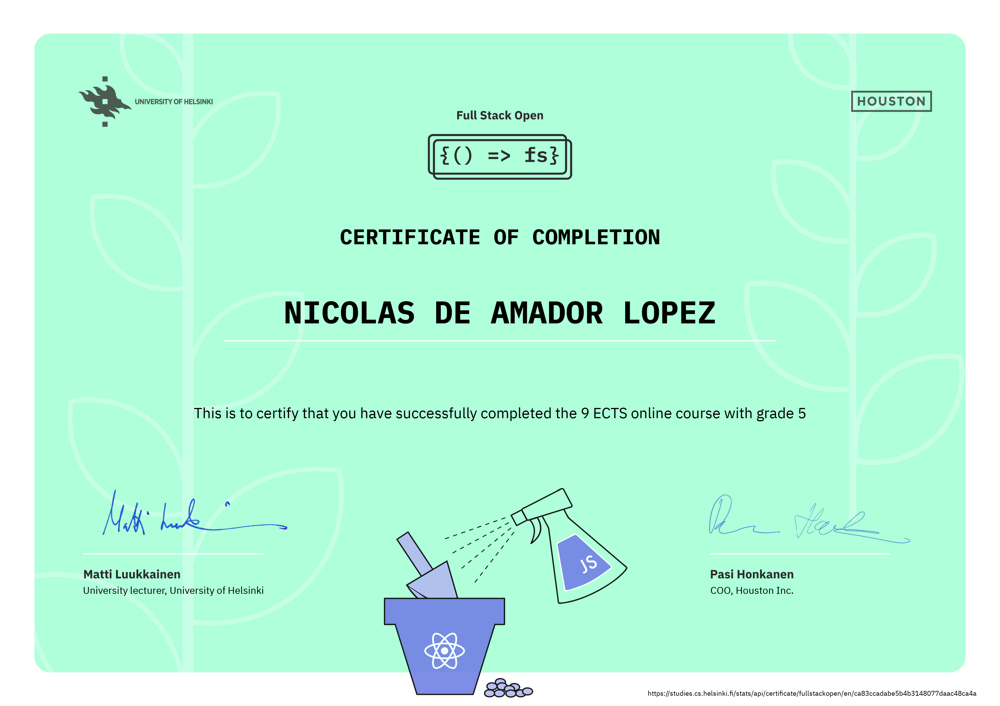
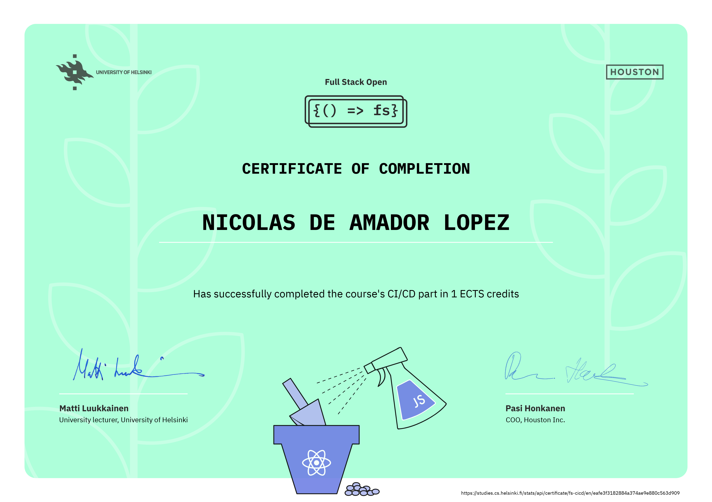
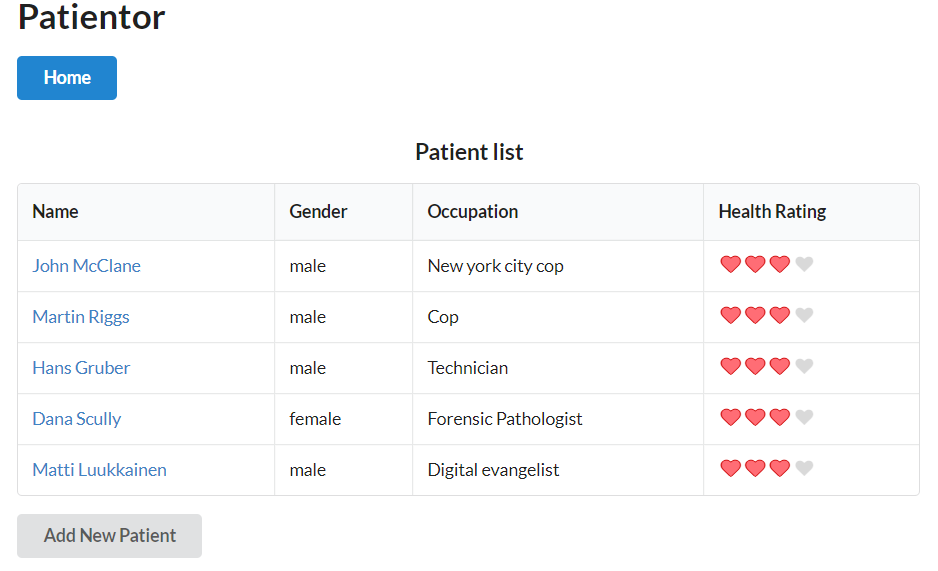
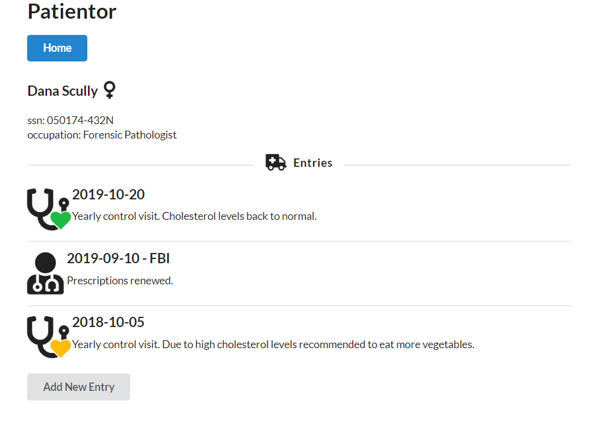
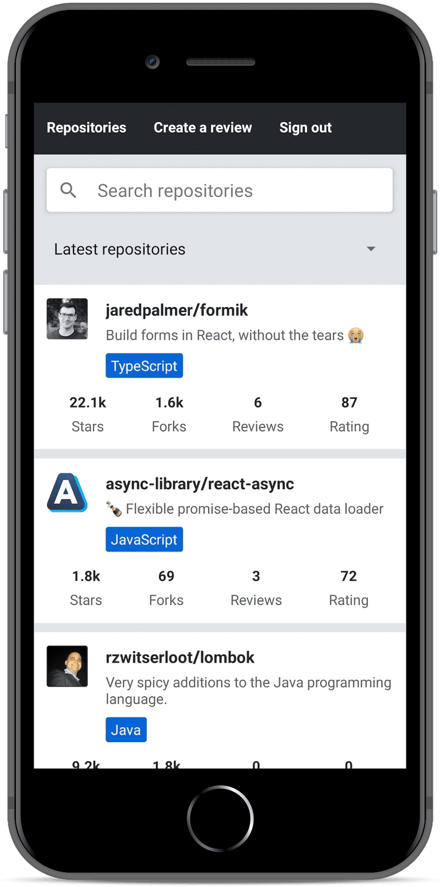

# [Full Stack Open 2020](https://fullstackopen.com/en/about) - Projects

Projects for the 2020 edition of the Full Stack Open course by the University of Helsinki, Finland.

---
## Certificates

  
Main course (9 credits)

  [Link to certificate in University of Helsinki's website](https://studies.cs.helsinki.fi/stats/api/certificate/fullstackopen/en/ca83ccadabe5b4b3148077daac48ca4a)

  

  
React Native (2 credits)

  [Link to certificate in University of Helsinki's website](https://studies.cs.helsinki.fi/stats/api/certificate/fs-react-native-2020/en/b2546840414ca0f644c69540ade127c3)

  

  
CI/CD (1 credit)

  [Link to certificate in University of Helsinki's website](https://studies.cs.helsinki.fi/stats/api/certificate/fs-cicd/en/eafe3f3182884a374ae9e880c563d909)

  

---

## Part 1 - [Introduction to React](https://fullstackopen.com/en/part1)

_JSX, state, event handling, rules of hooks..._

- [anecdotes app](https://github.com/ndeamador/FullStackOpen2020/tree/master/part1/anecdotes) - Cycle and vote programming anecdotes.
- [courseinfo app](https://github.com/ndeamador/FullStackOpen2020/tree/master/part1/courseinfo) - Basic introduction to React components.
- [unicafe app](https://github.com/ndeamador/FullStackOpen2020/tree/master/part1/unicafe) - A simple application for the cafe of the university to gather customer feedback. Introduction to state.

## Part 2 - [Communicating with server](https://fullstackopen.com/en/part2)

_JSON Server, Axios, Effect-hooks, REST..._

- [countries app](https://github.com/ndeamador/FullStackOpen2020/tree/master/part2/countries) - Find and display country information using a third party API.
- [phonebook app](https://github.com/ndeamador/FullStackOpen2020/tree/master/part2/phonebook) - CRUD and filter operations with phone contacts using a local database.

## Part 3 - [Programming a server with NodeJS and Express](https://fullstackopen.com/en/part3)

_REST APIs, MongoDB, Mongoose Postman, Middleware, Deploying to Heroku, Same origin policy and CORS, production build and deployment scripts, Proxy, Deploying database to production, Validation and ESLint..._

- [phonebook-backend](https://github.com/ndeamador/FullStackOpen2020/tree/master/part3/phonebook-backend) - Simple backend implementation for part2's phonebook using MongoDB. [Deployed to Heroku](https://ndeamador-fso2020-phonebook.herokuapp.com/).

## Part 4 - [Testing Express servers, user administration](https://fullstackopen.com/en/part4)

_Jest, test environment, supertest, unit and integration tests, async/await, user administration with Mongoose, bcrypt, populate, token-based authentication with jsonwebtoken, cross-env..._

- [bloglist app backend](https://github.com/ndeamador/FullStackOpen2020/tree/master/part4/bloglist) - A RESTful HTTP API

## Part 5 - [Testing React apps](https://fullstackopen.com/en/part5)

_browser's local storage, props.children and proptypes, references to components with React ref, react-testing-library, debugging tests, End to End (E2E) testing with Cypress, toggleable components, snapshot testing..._

- [bloglist app frontend](https://github.com/ndeamador/FullStackOpen2020/tree/master/part5/bloglist-frontend) - Bloglist App Front End with Jest and Cypress tests.

## Part 6 - [State management with Redux](https://fullstackopen.com/en/part6)

_Flux architecture, deep-freeze library, react-redux, Redux DevTools extension & redux-devtools-extension library, redux-thunk..._

- [redux-anecdotes app](https://github.com/ndeamador/FullStackOpen2020/tree/master/part6/redux-anecdotes) - Redux implementation of part1's anecdotes app.
- [unicafe-redux app](https://github.com/ndeamador/FullStackOpen2020/tree/master/part6/unicafe-redux) - Redux implementation of part1's unicafe app.

## Part 7 - [React router, custom hooks, styling app with CSS and webpack](https://fullstackopen.com/en/part7)

_React Bootstrap, MaterialUI, refactoring React apps to use Redux, Styled components, Webpack..._

- [bloglist-backend](https://github.com/ndeamador/FullStackOpen2020/tree/master/part7/bloglist-backend) - Refactor bloglist app to use Redux.
- [bloglist-frontend](https://github.com/ndeamador/FullStackOpen2020/tree/master/part7/bloglist-frontend) - Frontend for the above with added navigation and basic styling.
- [country-hook](https://github.com/ndeamador/FullStackOpen2020/tree/master/part7/country-hook) - countries app with custom hooks.
- [routed-anecdotes](https://github.com/ndeamador/FullStackOpen2020/tree/master/part7/routed-anecdotes) - Single-page, Redux-free implementation of the anecdotes app with React Routers.
- [ultimate-hooks](https://github.com/ndeamador/FullStackOpen2020/tree/master/part7/ultimate-hooks) - Backend for a notes app with the useResource hook.

## Part 8 - [GraphQL](https://fullstackopen.com/en/part8)

_uuid, Apollo client, Websockets, n+1 Query Problem, GraphQL Playground..._

- [library-backend](https://github.com/ndeamador/FullStackOpen2020/tree/master/part8/library-backend) - Apollo GraphQL backend for library app. Mongo/Mongoose database.
- [library-frontend](https://github.com/ndeamador/FullStackOpen2020/tree/master/part8/library-frontend) - Single-page frontend for GraphQL app.

## Part 9 - [Typescript](https://fullstackopen.com/en/part9)

_Typescript with Express and React, Semantic UI, Formik, React Context..._

- [TypeScript-intro](https://github.com/ndeamador/FullStackOpen2020/tree/master/part9/TypeScript-intro) - An introductory playground for the basics of Typescript. A simple bmi and exercise calculators.
- [courseinfo-react-ts](https://github.com/ndeamador/FullStackOpen2020/tree/master/part9/courseinfo-react-ts) - Implementation of Typescript to part1's courseinfo app.
- [patientor](https://github.com/ndeamador/FullStackOpen2020/tree/master/part9/patientor) - A website to keep track of hospital patients, visits and diagnoses.

  
  

## Part 10 - [React Native](https://fullstackopen.com/en/part10)

_Apollo, Android Virtual Studio, Expo, React Native Paper, debouncing, user-debounce, Infinite scrolling, Styled-components, React-spring, React Navigation..._

- [rate-repository-app](https://github.com/ndeamador/FullStackOpen2020/tree/master/part10/rate-repository-app) - Mobile Github repository rating app made with React Native.
- [rate-repository-api](https://github.com/ndeamador/FullStackOpen2020/tree/master/part10/rate-repository-api) - Apollo GraphQL backend for the above.

  

## Part 11 - [CI/CD](https://fullstackopen.com/en/part11)

_GitHub Actions, YAML, Deployment pipeline (testing, buildng, linting, versioning...), Slack, Github marketplace, merge protection..._

- [full-stack-open-pokedex](https://github.com/ndeamador/full-stack-open-pokedex) - CI/CD implementation for a Pokemon codex app.
- [full-stack-open-bloglist-with-cicd](https://github.com/ndeamador/full-stack-open-bloglist-with-cicd) - Basic CI/CD pipeline implementation for the bloglist application of parts 4 and 5.
